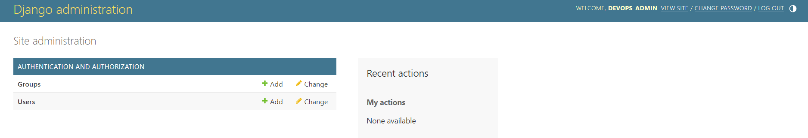
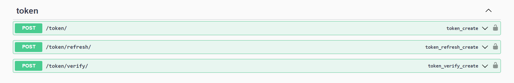
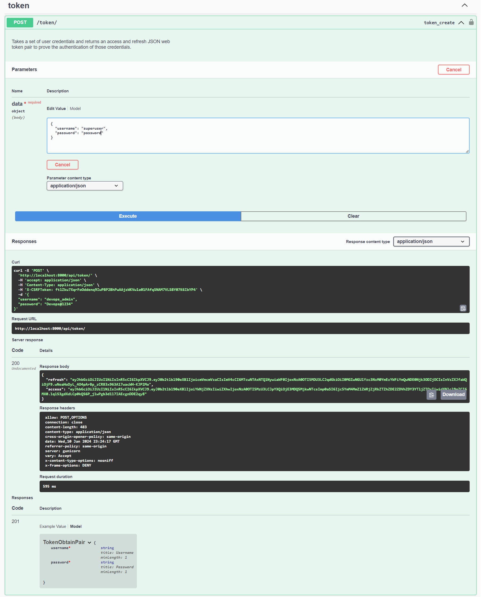

This repository provides a robust and extensible boilerplate for building RESTful APIs using Django, Gunicorn, Nginx and Swagger. Whether you're starting a new project or looking for a solid foundation to streamline your API development, this boilerplate aims to accelerate your workflow.

# Key Features:
**Django Framework:** Utilize the power of Django, a high-level web framework, for building scalable and maintainable APIs.

**Gunicorn Server:** Enhance the performance and reliability of your Django application with Gunicorn, a WSGI HTTP server.

**Swagger Documentation:** Implement interactive API documentation with Swagger UI, allowing developers to explore and test endpoints effortlessly.

**Django Rest Framework (DRF):** Leverage DRF to simplify API development, handle serialization, authentication, and provide a flexible and powerful toolkit.

**JSON Web Token (JWT) Authentication:** Secure your API with JWT authentication using djangorestframework-simplejwt.

**Nginx:** Enhance your Nginx setup with battle-tested configurations, ensuring a performant and secure web server environment.

# Getting Started
* Clone the repository.
* Set up your virtual environment and install dependencies.

# Pre-requisites
- VScode
- Ubuntu 22.04 (WSL)
    - we are going to use UBUNTU as a terminal in VSCode

NOTE:
* #-  change 'yourprojectname' as per your Project 

        yourprojectname
* #-  change 'yourappname' as per your App Name in the Project

        yourappname

* #- If you are using python3, replace python with python3

# Setup Sample Python APP with Swagger UI:
- Create python environment 

        python -m venv venv
- activate environment 

        source venv/bin/activate 
- Install Django
            
        pip install django
- Create a Django Project        
            
        django-admin startproject yourprojectname
- Navigate to Project Directory
    
        cd yourprojectname
- Create a Django App
            
        python manage.py startapp yourappname
- Install Django Rest Framework
            
        pip install djangorestframework
- Configure Django Settings 

        # yourprojectname/settings.py

        INSTALLED_APPS = [
            # ...
            'rest_framework',
            ]
- Create a Sample API View

        # yourappname/views.py

        from rest_framework.views import APIView
        from rest_framework.response import Response

        class HelloAPIView(APIView):
            def get(self, request):
                return Response({'message': 'Hello, World!'})  
- Configure URL Patterns
            
        # yourappname/urls.py

        from django.urls import path
        from .views import HelloAPIView

        urlpatterns = [
            path('hello/', HelloAPIView.as_view(), name='hello-api'),
        ]  
- Include these URLs in the project's 'urls.py'

        # yourprojectname/urls.py

        from django.contrib import admin
        from django.urls import path, include

        urlpatterns = [
            path('admin/', admin.site.urls),
            path('api/', include('yourappname.urls')),
        ]
- Generate Swagger Documentation
    
        pip install drf-yasg
- Add 'drf_yasg' to the INSTALLED_APPS in your 'settings.py' file

        # yourprojectname/settings.py

        INSTALLED_APPS = [
            # ...
            'drf_yasg',
        ]
- Configure the Swagger UI settings in your 'urls.py'

        # yourprojectname/urls.py

        from django.contrib import admin
        from django.urls import path, include
        from rest_framework import permissions
        from drf_yasg.views import get_schema_view
        from drf_yasg import openapi

        schema_view = get_schema_view(
            openapi.Info(
                title="Your API",
                default_version='v1',
                description="Your API description",
                terms_of_service="https://www.yourapp.com/terms/",
                contact=openapi.Contact(email="contact@yourapp.com"),
                license=openapi.License(name="Your License"),
            ),
            public=True,
            permission_classes=(permissions.AllowAny,),
        )

        urlpatterns = [
            path('admin/', admin.site.urls),
            path('api/', include('yourappname.urls')),
            path('swagger/', schema_view.with_ui('swagger', cache_timeout=0), name='schema-swagger-ui'),
        ]
- Run the Development Server
            
        python manage.py runserver
- Visit http://localhost:8000/swagger/ in your browser to access the Swagger UI and explore your API

# Setup Gunicorn 
- Install Gunicorn

        pip install gunicorn
- Create a Gunicorn configuration file, e.g., gunicorn_config.py in your project's root directory

        bind = '0.0.0.0:8000'
        workers = 4 
    
    This configuration tells Gunicorn to bind to all available network interfaces on port 8000 and use 4 worker processes. You can adjust these settings based on your requirements.

    Standard Formula for the Worker allocation is [{(2 x $num_cores) + 1}](https://docs.gunicorn.org/en/stable/design.html#how-many-workers)

    DO NOT scale the number of workers to the number of clients you expect to have. Gunicorn should only need 4-12 worker processes to handle hundreds or thousands of requests per second.
-  Run Gunicorn to serve your Django application

        gunicorn yourprojectname.wsgi:application -c gunicorn_config.py

    After executing the above command you might see some error message like this-

        Not Found: /static/drf-yasg/swagger-ui-dist/swagger-ui-standalone-preset.js
        Not Found: /static/drf-yasg/insQ.min.js
        Not Found: /static/drf-yasg/immutable.min.js
        Not Found: /static/drf-yasg/swagger-ui-init.js
        Not Found: /static/drf-yasg/style.css
        Not Found: /static/drf-yasg/swagger-ui-dist/swagger-ui.css
        Not Found: /static/drf-yasg/swagger-ui-dist/swagger-ui-bundle.js
        Not Found: /accounts/login/
    to come over with the above error follow next steps
- Configure Django to Serve Static Files

    - Add this line at the end of this file 'yourprojectname/settings.py' 

            # yourprojectname/settings.py

            # Add the following lines at the end of the file
            STATIC_URL = '/static/'
            STATIC_ROOT = BASE_DIR / "static"
    - Collect drf-yasg Static Files 
            
            python manage.py collectstatic
        output for the above command will be like this

            195 static files copied to '/mnt/d/Github-VivifyHealthcare/R_n_D/pythonsample/yourprojectname/static'
    - Check & Update URL Configuration, update missing parameters from the below
   
            # yourprojectname/urls.py

            from django.contrib import admin
            from django.urls import path, include
            from django.conf import settings
            from django.conf.urls.static import static

            urlpatterns = [
                path('admin/', admin.site.urls),
                path('api/', include('yourappname.urls')),
                path('swagger/', schema_view.with_ui('swagger', cache_timeout=0), name='schema-swagger-ui'),
            ]

        - Add the following lines for serving static files during development at the end of Your Project's 'urls.py' file
        
                # yourprojectname/urls.py

                if settings.DEBUG:
                    urlpatterns += static(settings.STATIC_URL, document_root=settings.STATIC_ROOT)
-  Run Gunicorn again to serve your Django application

        gunicorn yourprojectname.wsgi:application -c gunicorn_config.py
- Visit http://127.0.0.1:8000/swagger/  or http://localhost:8000/swagger/ in your browser to access the Swagger UI and explore your API

# Additional Swagger Settings:
- route the Swagger documentation to the root URL instead of /swagger
    - Update URL Patterns

            urlpatterns = [
                path('admin/', admin.site.urls),
                path('api/', include('yourappname.urls')),
                path('', schema_view.with_ui('swagger', cache_timeout=0), name='schema-swagger-ui'),
             ]
- Visit http://127.0.0.1:8000/ or http://localhost:8000/ in your browser to access the Swagger UI and explore your API

# Serve Your API via [ngrok](https://ngrok.com/download) (Optional)
    ngrok http 8000
or 

# Install Nginx (Optional)
- Install Nginx

        sudo apt-get update
        sudo apt-get install nginx
    
-  Configure Nginx
    - Create a new Nginx configuration file 
        
                sudo nano /etc/nginx/sites-available/yourprojectname
        Add the following configuration (adjust paths as needed)
                
                server {
                    listen 80;
                    server_name yourdomain.com wwwyourdomain.com;
                    # server_name <machine-ip>;
                    
                    location = /favicon.ico { access_log off; log_not_found off;
                     }
                    location /static/ 
                    {
                        # root /path/to/yourprojectname;
                        root /mnt/d/Github-VivifyHealthcare/R_n_D/pythonsample/yourprojectname;
                        }
                    location / 
                        {
                        include proxy_params;
                        proxy_pass http://0.0.0.0:8000;
                        }
                        }
                
        for 'SERVER_NAME' if you have domain name you can configure domain name or else if you can configure 'machine_ip'

    - Create a symbolic link to enable the configuration

            sudo ln -s /etc/nginx/sites-available/yourprojectname /etc/nginx/sites-enabled
    - Test Nginx configuration and restart Nginx

            sudo nginx -t
            
        Output of the above command will be like this 
        
              nginx: the configuration file /etc/nginx/nginx.conf syntax is ok
              nginx: configuration file /etc/nginx/nginx.conf test is successful
    
     - Restart Nginx
            
            sudo systemctl restart nginx
    - Check Status of Nginx
            
            sudo systemctl status nginx

        
        to Stop Nginx use
            
            sudo systemctl stop nginx

# Add firewall rule (optional)
- install ufw (if not installed)
        
        sudo apt-get update
        sudo apt-get install ufw
- Allow Incoming Traffic on the Desired Port
    
    for django
        
        sudo ufw allow 8000
     
    for Nginx
        
        sudo ufw allow 80
- Enable Firewall

        sudo ufw enable
    
    Check Status of Firewall

        sudo ufw status

# Enable JWT token for Your API (optional)

- Visit Django Admin via http://localhost:8000/admin or http://127.0.0.1:8000/admin

- Create Super User for Django

        python manage.py createsuperuser

    if you see some error like this 

        You have 18 unapplied migration(s). Your project may not work properly until you apply the migrations for app(s): admin, auth, contenttypes, sessions.
    Run Migrations to apply them
        
        python manage.py migrate
    And re-run the command to create Super User
    
    
- Install djangorestframework-simplejwt

        pip install djangorestframework-simplejwt
- Configure Django Settings: 

        # yourprojectname/settings.py

        # Application definition

        INSTALLED_APPS = [
            'django.contrib.admin',
            'django.contrib.auth',
            'django.contrib.contenttypes',
            'django.contrib.sessions',
            'django.contrib.messages',
            'django.contrib.staticfiles',
            # Django Rest Framework and Swagger
            'rest_framework',
            'drf_yasg',
            # JWT
            'rest_framework_simplejwt',
        ]

        # JWT
        REST_FRAMEWORK = {
            'DEFAULT_AUTHENTICATION_CLASSES': [
                'rest_framework_simplejwt.authentication.JWTAuthentication',
            ],
        }
    Add 'rest_framework_simplejwt' to the INSTALLED_APPS and configure the authentication classes in your settings.py file
- Update URL Patterns: 

        # yourappname/urls.py

        from django.urls import path
        from rest_framework_simplejwt.views import TokenObtainPairView, TokenRefreshView, TokenVerifyView
        from .views import HelloAPIView

        urlpatterns = [
            path('hello/', HelloAPIView.as_view(), name='hello-api'),
            path('token/', TokenObtainPairView.as_view(), name='token_obtain_pair'),
            path('token/refresh/', TokenRefreshView.as_view(), name='token_refresh'),
            path('token/verify/', TokenVerifyView.as_view(), name='token_verify'),
        ]
    Update your app's urls.py to include the token views provided by djangorestframework-simplejwt

    
- Create Bearer Token; using Django Superuser Credentials; just created above

    

- increase / set the expiry duration of the generated token 

        # yourprojectname/settings.py

        from datetime import timedelta

        # Set the expiration time for access and refresh tokens (example: 1 day for access tokens, 7 days for refresh tokens)

        SIMPLE_JWT = {
        'ACCESS_TOKEN_LIFETIME': timedelta(days=1),
        'REFRESH_TOKEN_LIFETIME': timedelta(days=7),
        }

---
---
Reference **FINAL VIEW** for the files being created or updated  during the setup process

- yourprojectname/settings.py

        """
        Django settings for yourprojectname project.

        Generated by 'django-admin startproject' using Django 5.0.1.

        For more information on this file, see
        https://docs.djangoproject.com/en/5.0/topics/settings/

        For the full list of settings and their values, see
        https://docs.djangoproject.com/en/5.0/ref/settings/
        """

        from pathlib import Path
        from datetime import timedelta
        # from secrets import DJANGO_SECRET_KEY

        # Build paths inside the project like this: BASE_DIR / 'subdir'.
        BASE_DIR = Path(__file__).resolve().parent.parent

        # Quick-start development settings - unsuitable for production
        # See https://docs.djangoproject.com/en/5.0/howto/deployment/checklist/

        # SECURITY WARNING: keep the secret key used in production secret!
        SECRET_KEY = <YOUR_Django_SECRET_KEY> 

        # SECURITY WARNING: don't run with debug turned on in production!
        DEBUG = True

        ALLOWED_HOSTS = ['*']

        # Application definition

        INSTALLED_APPS = [
            'django.contrib.admin',
            'django.contrib.auth',
            'django.contrib.contenttypes',
            'django.contrib.sessions',
            'django.contrib.messages',
            'django.contrib.staticfiles',
            # Django Rest Framework and Swagger
            'rest_framework',
            'drf_yasg',
            # JWT
            'rest_framework_simplejwt',
        ]

        # JWT
        REST_FRAMEWORK = {
            'DEFAULT_AUTHENTICATION_CLASSES': [
                'rest_framework_simplejwt.authentication.JWTAuthentication',
            ],
        }

        MIDDLEWARE = [
            'django.middleware.security.SecurityMiddleware',
            'django.contrib.sessions.middleware.SessionMiddleware',
            'django.middleware.common.CommonMiddleware',
            'django.middleware.csrf.CsrfViewMiddleware',
            'django.contrib.auth.middleware.AuthenticationMiddleware',
            'django.contrib.messages.middleware.MessageMiddleware',
            'django.middleware.clickjacking.XFrameOptionsMiddleware',
        ]

        ROOT_URLCONF = 'yourprojectname.urls'

        TEMPLATES = [
            {
                'BACKEND': 'django.template.backends.django.DjangoTemplates',
                'DIRS': [],
                'APP_DIRS': True,
                'OPTIONS': {
                    'context_processors': [
                        'django.template.context_processors.debug',
                        'django.template.context_processors.request',
                        'django.contrib.auth.context_processors.auth',
                        'django.contrib.messages.context_processors.messages',
                    ],
                },
            },
        ]

        WSGI_APPLICATION = 'yourprojectname.wsgi.application'

        # Database
        # https://docs.djangoproject.com/en/5.0/ref/settings/#databases

        DATABASES = {
            'default': {
                'ENGINE': 'django.db.backends.sqlite3',
                'NAME': BASE_DIR / 'db.sqlite3',
            }
        }

        # Password validation
        # https://docs.djangoproject.com/en/5.0/ref/settings/#auth-password-validators

        AUTH_PASSWORD_VALIDATORS = [
            {
                'NAME': 'django.contrib.auth.password_validation.UserAttributeSimilarityValidator',
            },
            {
                'NAME': 'django.contrib.auth.password_validation.MinimumLengthValidator',
            },
            {
                'NAME': 'django.contrib.auth.password_validation.CommonPasswordValidator',
            },
            {
                'NAME': 'django.contrib.auth.password_validation.NumericPasswordValidator',
            },
        ]

        # Internationalization
        # https://docs.djangoproject.com/en/5.0/topics/i18n/

        LANGUAGE_CODE = 'en-us'

        TIME_ZONE = 'UTC'

        USE_I18N = True

        USE_TZ = True

        # Static files (CSS, JavaScript, Images)
        # https://docs.djangoproject.com/en/5.0/howto/static-files/

        STATIC_URL = 'static/'
        STATIC_ROOT = BASE_DIR / "static"

        # Default primary key field type
        # https://docs.djangoproject.com/en/5.0/ref/settings/#default-auto-field

        DEFAULT_AUTO_FIELD = 'django.db.models.BigAutoField'

        SIMPLE_JWT = {
            'ACCESS_TOKEN_LIFETIME': timedelta(days=90),
            'REFRESH_TOKEN_LIFETIME': timedelta(days=90),
        }
- yourprojectname/urls.py

        """
        URL configuration for yourprojectname project.

        The `urlpatterns` list routes URLs to views. For more information please see:
            https://docs.djangoproject.com/en/5.0/topics/http/urls/
        Examples:
        Function views
            1. Add an import:  from my_app import views
            2. Add a URL to urlpatterns:  path('', views.home, name='home')
        Class-based views
            1. Add an import:  from other_app.views import Home
            2. Add a URL to urlpatterns:  path('', Home.as_view(), name='home')
        Including another URLconf
            1. Import the include() function: from django.urls import include, path
            2. Add a URL to urlpatterns:  path('blog/', include('blog.urls'))
        """

        from django.contrib import admin
        from django.urls import path, include
        from rest_framework import permissions
        from drf_yasg.views import get_schema_view
        from drf_yasg import openapi
        # Gunicorn Static file Settings
        from django.conf import settings
        from django.conf.urls.static import static

        schema_view = get_schema_view(
            openapi.Info(
                title="Your API",
                default_version='v1',
                description="Your API description",
                terms_of_service="https://www.yourapp.com/terms/",
                contact=openapi.Contact(email="contact@yourapp.com"),
                license=openapi.License(name="Your License"),
            ),
            public=True,
            permission_classes=(permissions.AllowAny,),
        )

        urlpatterns = [
            path('admin/', admin.site.urls),
            path('api/', include('yourappname.urls')),
            # path('swagger/', schema_view.with_ui('swagger', cache_timeout=0), name='schema-swagger-ui'),
            path('', schema_view.with_ui('swagger', cache_timeout=0), name='schema-swagger-ui'),

        ]

        # Add the following lines for serving static files during development
        if settings.DEBUG:
            urlpatterns += static(settings.STATIC_URL, document_root=settings.STATIC_ROOT)
- yourappname/views.py

        from django.shortcuts import render

        # Create your views here.
        from rest_framework.views import APIView
        from rest_framework.response import Response

        class HelloAPIView(APIView):
            def get(self, request):
                return Response({'message': 'Hello, World!'})
- yourappname/urls.py

        from django.urls import path
        from rest_framework_simplejwt.views import TokenObtainPairView, TokenRefreshView, TokenVerifyView
        from .views import HelloAPIView

        urlpatterns = [
            path('hello/', HelloAPIView.as_view(), name='hello-api'),
            path('token/', TokenObtainPairView.as_view(), name='token_obtain_pair'),
            path('token/refresh/', TokenRefreshView.as_view(), name='token_refresh'),
            path('token/verify/', TokenVerifyView.as_view(), name='token_verify'),
        ]
- gunicorn_config.py

        bind = '0.0.0.0:8000'
        workers = 4
- /etc/nginx/sites-available/yourprojectname

        # Add the following configuration (adjust paths as needed)
        server {
            listen 80;
        # server_name yourdomain.com www.yourdomain.com;
            server_name   49.43.229.80;

            location = /favicon.ico { access_log off; log_not_found off; }
            location /static/ {
            # root /path/to/yourprojectname;
                root /mnt/d/Github-VivifyHealthcare/R_n_D/pythonsample/yourprojectname;

# Contributions:
Contributions, bug reports, and feature requests are welcome! Please open an issue or submit a pull request to help improve and evolve this boilerplate.